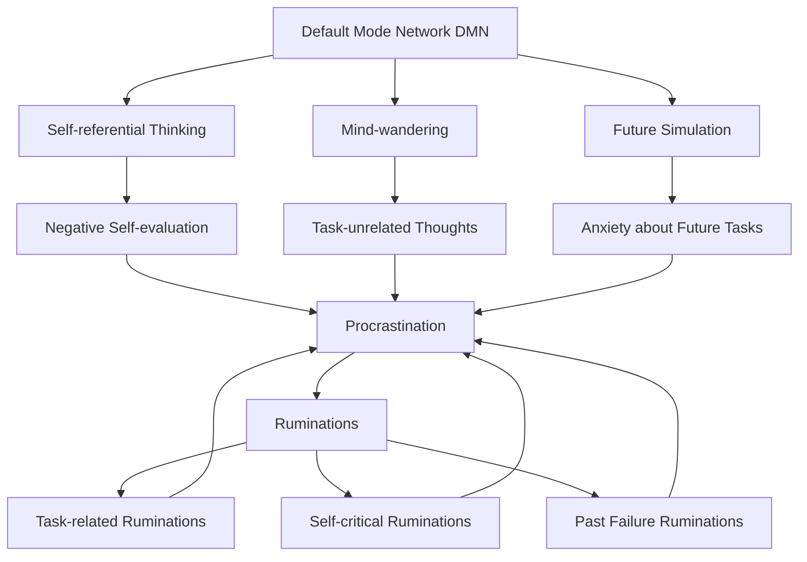

---
{"dg-publish":true,"permalink":"/research/"}
---

# Research: Most Effective Interventions for Procrastination

## Table of Contents
1. [[Introduction\|Introduction]]
2. [[Definition_of_Procrastination\|Definition_of_Procrastination]]
3. [[Common_Causes_of_Procrastination\|Common_Causes_of_Procrastination]]
4. [[Emotional_Aspects_of_Procrastination\|Emotional_Aspects_of_Procrastination.md]]
5. [Effective Interventions](Effective_Interventions.md)
6. [Case Studies](Case_Studies.md)
7. [Conclusion](Conclusion.md)
8. [References](References.md)

## Definition of Procrastination

Procrastination is the act of delaying or postponing tasks or actions, often despite knowing that such delay may have negative consequences. It's important to understand that procrastination is not simply laziness or poor time management. Key points about procrastination include:

1. Voluntary delay: Procrastination involves choosing to delay a task, even when we know we should be doing it.
2. Irrational behavior: We procrastinate despite expecting to be worse off for the delay.
3. Present bias: Procrastination often involves prioritizing short-term mood regulation over long-term goals.
4. Task aversion: We tend to procrastinate more on tasks we find unpleasant or challenging.
5. Intention-action gap: Procrastinators often have the intention to complete tasks but struggle to initiate action.

Understanding these aspects of procrastination is crucial for developing effective strategies to overcome it. Recognizing procrastination as a complex behavior involving emotional, cognitive, and behavioral components can help individuals approach it more comprehensively and compassionately.

## [[History of Procrastination\|History of Procrastination]]

<a class="markdown-embed-link" href="/definition-of-procrastination/" aria-label="Open link"><svg xmlns="http://www.w3.org/2000/svg" width="24" height="24" viewBox="0 0 24 24" fill="none" stroke="currentColor" stroke-width="2" stroke-linecap="round" stroke-linejoin="round" class="svg-icon lucide-link"><path d="M10 13a5 5 0 0 0 7.54.54l3-3a5 5 0 0 0-7.07-7.07l-1.72 1.71"></path><path d="M14 11a5 5 0 0 0-7.54-.54l-3 3a5 5 0 0 0 7.07 7.07l1.71-1.71"></path></svg></a>

# Definition of Procrastination

Procrastination is the act of delaying or postponing tasks or actions, often despite knowing that such delay may have negative consequences. It's important to understand that procrastination is not simply laziness or poor time management. Key points about procrastination include:

1. Voluntary delay: Procrastination involves choosing to delay a task, even when we know we should be doing it.
2. Irrational behavior: We procrastinate despite expecting to be worse off for the delay.
3. Present bias: Procrastination often involves prioritizing short-term mood regulation over long-term goals.
4. Task aversion: We tend to procrastinate more on tasks we find unpleasant or challenging.
5. Intention-action gap: Procrastinators often have the intention to complete tasks but struggle to initiate action.

Understanding these aspects of procrastination is crucial for developing effective strategies to overcome it. Recognizing procrastination as a complex behavior involving emotional, cognitive, and behavioral components can help individuals approach it more comprehensively and compassionately.

## Definition of Procrastination

Let's talk about procrastination - you know, that thing we all do when we should be doing something important but end up scrolling through social media instead. It's not just about being lazy or bad at managing time. Nope, it's a bit more complicated than that.

Procrastination is like a mental tug-of-war. On one side, you've got what you know you should be doing, and on the other, you've got... well, anything else that seems more appealing at the moment. It's when you voluntarily put off doing something, even though you know you'll probably regret it later. Sounds familiar, right?

Now, don't confuse procrastination with just being lazy. Lazy people don't want to do anything, period. Procrastinators, on the other hand, often want to do the task - they just can't seem to get started. And it's not just about poor time management either. You can be a pro at scheduling and still find yourself procrastinating.

It's also important to distinguish between procrastination and strategic delay. While they might look similar on the surface, they're quite different:

1. Procrastination is an irrational delay of tasks despite expecting to be worse off for the delay. It's often accompanied by negative emotions like guilt or anxiety.

2. Strategic delay, on the other hand, is a deliberate decision to postpone a task for a good reason. This could be to gather more information, wait for better conditions, or prioritize more urgent tasks. Unlike procrastination, strategic delay is a rational choice that often leads to better outcomes.

For example, if you're putting off studying for an exam because you're anxious about it, that's procrastination. But if you're delaying your study session because you're waiting for your noisy roommates to leave so you can concentrate better, that's strategic delay.

Understanding this difference is crucial because it helps us identify when we're truly procrastinating and when we're making a strategic choice. It can also alleviate some of the guilt associated with necessary delays, while helping us recognize and address harmful procrastination habits.

What makes procrastination tricky is that it's not just about delaying tasks. It's about the unnecessary delay of tasks. It's when you know you could start now, but you choose not to. And here's the kicker - you make this choice even though you know it's not in your best interest. It's like choosing to eat that extra slice of cake when you're on a diet. You know you shouldn't, but you do it anyway.

The real kicker? This behavior is super common. We're talking about 15-20% of adults and a whopping 50% of college students who struggle with chronic procrastination. So if you're a procrastinator, you're definitely not alone in this boat!

Remember, procrastination often comes with a side of guilt, anxiety, or stress. It's that nagging feeling in the back of your mind reminding you of what you should be doing while you're busy doing... well, not that.

So next time you find yourself putting off that important task, remember: you're not lazy, you're not necessarily bad at managing time. You're just caught in the procrastination trap. And hey, recognizing it is the first step to beating it!

## Common Causes of Procrastination

<a class="markdown-embed-link" href="/common-causes-of-procrastination/" aria-label="Open link"><svg xmlns="http://www.w3.org/2000/svg" width="24" height="24" viewBox="0 0 24 24" fill="none" stroke="currentColor" stroke-width="2" stroke-linecap="round" stroke-linejoin="round" class="svg-icon lucide-link"><path d="M10 13a5 5 0 0 0 7.54.54l3-3a5 5 0 0 0-7.07-7.07l-1.72 1.71"></path><path d="M14 11a5 5 0 0 0-7.54-.54l-3 3a5 5 0 0 0 7.07 7.07l1.71-1.71"></path></svg></a>

1. Psychological Factors:
   a) [[Fear of Failure\|Fear of failure]]: Individuals may delay tasks due to anxiety about not meeting expectations or performing poorly.
   b) [[Perfectionism\|Perfectionism]]: The desire for flawless results can lead to task avoidance when perfection seems unattainable.
   c) Low [[Self-Efficacy\|self-efficacy]]: Doubts about one's ability to complete a task successfully can result in procrastination.
   d) [[Impulsivity\|Impulsivity]]: Difficulty in delaying gratification can lead to choosing short-term pleasures over long-term goals.
   e) [[Depression\|Depression]] and [[Anxiety\|anxiety]]: These mental health conditions can significantly impact motivation and task initiation.

2. Biological and Neurological Factors:
   a) Executive function deficits: Weaknesses in planning, organizing, and initiating tasks can contribute to procrastination.
   b) Dopamine regulation: Variations in dopamine levels and sensitivity can affect motivation and reward-seeking behavior.
   c) Genetic predisposition: Some studies suggest a genetic component to procrastination tendencies (Gustavson et al., 2014).

3. Environmental and Social Factors:
   a) [[Task Aversion\|Task aversiveness]]: Unpleasant or challenging tasks are more likely to be postponed.
   b) Lack of structure: Absence of clear deadlines or accountability can enable procrastination.
   c) Distractions: The prevalence of digital devices and social media can easily divert attention from important tasks.
   d) Social influences: Peer pressure or cultural norms may sometimes encourage or normalize procrastination.
   e) Work/study environment: Physical surroundings that are not conducive to focus can promote procrastination.

By identifying the specific causes of procrastination in individual cases, it becomes easier to develop targeted strategies for overcoming this behavior. It's important to note that procrastination often results from a combination of these factors, and addressing multiple causes simultaneously may be necessary for effective intervention.

Procrastination is a complex behavior influenced by various psychological, biological, and environmental factors. Understanding these causes is crucial for developing effective interventions.

1. Psychological Factors:

<a class="markdown-embed-link" href="/emotional-aspects-of-procrastination/" aria-label="Open link"><svg xmlns="http://www.w3.org/2000/svg" width="24" height="24" viewBox="0 0 24 24" fill="none" stroke="currentColor" stroke-width="2" stroke-linecap="round" stroke-linejoin="round" class="svg-icon lucide-link"><path d="M10 13a5 5 0 0 0 7.54.54l3-3a5 5 0 0 0-7.07-7.07l-1.72 1.71"></path><path d="M14 11a5 5 0 0 0-7.54-.54l-3 3a5 5 0 0 0 7.07 7.07l1.71-1.71"></path></svg></a>

### The Role of Emotions in Procrastination

Emotions play a crucial role in the procrastination process. Procrastination is often used as a short-term mood regulation strategy, where individuals prioritize immediate emotional relief over long-term goals. Key emotional factors include:

1. [[Fear\|Fear]] and [[Anxiety\|anxiety]]: Fear of failure or success can lead to task avoidance.
2. [[Boredom\|Boredom]]: Tasks perceived as uninteresting may be postponed.
3. [[Frustration\|Frustration]]: Challenging tasks may trigger frustration, leading to avoidance.
4. [[Guilt\|Guilt]] and [[shame\|shame]]: Paradoxically, these emotions can both result from and perpetuate procrastination.

# Emotional Aspects of Procrastination

The emotional component of procrastination is often overlooked but plays a crucial role in both perpetuating and overcoming this behavior. Understanding the emotional aspects can provide valuable insights for developing effective interventions.

1. Emotional regulation:
   - Procrastination often serves as a short-term mood repair strategy.
   - Individuals may delay tasks to avoid negative emotions associated with them.
   - This creates a cycle of temporary relief followed by increased stress and anxiety.

2. Guilt and shame:
   - Procrastination often leads to feelings of guilt and shame.
   - These negative emotions can further reinforce procrastination behaviors.
   - Breaking this cycle is crucial for overcoming procrastination.

3. Anxiety and fear:
   - Fear of failure or success can trigger procrastination.
   - Anxiety about task performance or outcomes can lead to avoidance.
   - Addressing these underlying fears is essential for reducing procrastination.

4. Boredom and frustration:
   - Tasks perceived as boring or frustrating are more likely to be procrastinated.
   - Developing strategies to make tasks more engaging or manageable can help.

5. Emotional intelligence:
   - Higher emotional intelligence can lead to better self-regulation and less procrastination.
   - Developing skills to recognize and manage emotions can be beneficial.

6. Stress response:
   - Chronic procrastination can lead to increased stress levels.
   - This stress can further impair decision-making and self-regulation abilities.

7. Self-compassion:
   - Practicing self-compassion, rather than self-criticism, can help break the procrastination cycle.
   - It allows for a more balanced and constructive approach to task completion.

Understanding and addressing these emotional aspects of procrastination is crucial for developing effective interventions. Techniques such as mindfulness, cognitive-behavioral therapy, and emotional regulation strategies can be particularly helpful in managing the emotional components of procrastination.

### Impulse Control and Procrastination

[[Impulse control\|Impulse control]], or the ability to resist immediate temptations in favor of long-term goals, is closely linked to procrastination:

1. [[Delayed gratification\|Delayed gratification]]: Procrastinators often struggle with prioritizing future rewards over immediate pleasures.
2. Impulsivity and distractibility: Higher levels of impulsivity are associated with increased procrastination tendencies.
3. [[Executive function\|Executive function]]: Weaknesses in executive functions, including impulse control, can contribute to procrastination behaviors.

### The Importance of Feeling Your Feelings

Understanding and experiencing emotions is crucial for effective self-regulation and overcoming procrastination:

1. Emotional guidance: Emotions serve as an internal guidance system, providing valuable information about our needs, values, and goals.
2. Decision-making: Feeling our emotions is essential for making sound decisions, as demonstrated by studies on individuals with impaired emotional processing.
3. Behavioral flexibility: Acknowledging and accepting emotions creates a space between stimulus and response, allowing for more thoughtful actions.
4. Empathy and social connection: The ability to feel and understand our own emotions enhances our capacity to empathize with others and build stronger relationships.

### Self-Regulation Techniques for Managing Procrastination

Effective self-regulation strategies can help individuals manage their emotions and impulses to reduce procrastination:

1. [[Emotional awareness\|Emotional awareness]]: Recognizing and labeling emotions associated with procrastination.
2. [[Mindfulness practices\|Mindfulness practices]]: Using mindfulness to observe thoughts and emotions without judgment, reducing their impact on behavior.
3. [[Implementation Intentions\|Implementation intentions]]: Creating specific "if-then" plans to manage emotional triggers and maintain focus on tasks.
4. [[Emotion regulation strategies\|Emotion regulation strategies]]: Employing techniques like cognitive reappraisal to change emotional responses to tasks.
5. [[Self-Compassion\|Self-compassion]]: Practicing self-kindness to reduce the negative emotional cycle often associated with procrastination.
6. [[Acceptance\|Acceptance]]: Allowing emotions to be present without trying to change or suppress them, which can paradoxically reduce their intensity.
7. [[Somatic awareness\|Somatic awareness]]: Paying attention to the physical sensations of emotions in the body to enhance emotional intelligence and decision-making.

These self-regulation techniques, when consistently applied, can significantly improve an individual's ability to manage procrastination tendencies and achieve their goals more effectively. By learning to feel and work with their emotions rather than against them, individuals can develop greater resilience, self-understanding, and motivation to overcome procrastination.

## Ruminations, Default Mode Network, and Mindfulness

Procrastination is often closely linked to rumination and the activity of the Default Mode Network (DMN) in the brain. Understanding these connections can provide valuable insights into why we procrastinate and how mindfulness can help combat this behavior.

### Ruminations and Procrastination

Rumination refers to the tendency to repetitively think about the causes, situational factors, and consequences of one's negative emotional experience (Nolen-Hoeksema et al., 2008). In the context of procrastination:

1. Task-related ruminations: Individuals may obsessively think about a task without actually starting it, leading to increased anxiety and avoidance.
2. Self-critical ruminations: Negative self-talk about one's ability to complete tasks can reinforce procrastination behaviors.
3. Past failure ruminations: Dwelling on previous instances of procrastination or failure can create a self-fulfilling prophecy of continued delay.

Research has shown a strong correlation between rumination and procrastination, with rumination often serving as a cognitive manifestation of procrastination (Stainton et al., 2000). This relationship can be understood as follows:

1. Overthinking tasks: Rumination involves repetitive thoughts about tasks, their difficulty, and potential outcomes, which can lead to task avoidance.

2. Self-critical thoughts: Ruminative thinking often includes negative self-evaluations, which can decrease motivation and increase procrastination.

3. Perfectionism: Rumination can fuel perfectionist tendencies, making it harder to start or complete tasks due to unrealistic standards.

4. Emotional amplification: Ruminating on negative emotions associated with tasks can intensify anxiety or dread, making procrastination more likely.

5. Decision paralysis: Excessive rumination can lead to difficulty in making decisions, resulting in delayed action or task initiation.

6. Focus on past failures: Ruminating on previous instances of procrastination or failure can create a self-fulfilling prophecy of continued delay.

By understanding this connection, individuals can work on addressing both rumination and procrastination simultaneously, potentially breaking the cycle of negative thoughts and delayed action.

### The Default Mode Network (DMN)

The Default Mode Network is a set of interconnected brain regions that are active when an individual is not focused on the external environment. It plays a crucial role in self-referential thinking, mind-wandering, and rumination (Raichle, 2015). The DMN's activity is relevant to procrastination in several ways:

1. Mind-wandering: Increased DMN activity can lead to task-unrelated thoughts, making it difficult to initiate or stay focused on tasks.
2. Self-referential thinking: The DMN is involved in thinking about oneself, which can contribute to self-doubt and negative self-evaluation, common in procrastinators.
3. Future simulation: While the DMN can help in planning for the future, it can also contribute to anxiety about future tasks, potentially leading to avoidance behaviors.

Studies have shown that individuals who procrastinate often exhibit higher levels of DMN activity, suggesting a link between default mode brain functioning and procrastination tendencies (Hu et al., 2018).

This diagram illustrates the relationship between the Default Mode Network (DMN), its associated cognitive processes, and how they contribute to procrastination and ruminations. The cycle shows how procrastination can lead to various types of ruminations, which in turn reinforce procrastination behaviors.

### Mindfulness as an Intervention

Mindfulness, defined as the state of being aware and attentive to the present moment without judgment, has emerged as a powerful tool in combating procrastination. It works by addressing both rumination and DMN activity:

1. Reducing rumination: Mindfulness practices help individuals recognize and disengage from ruminative thought patterns, reducing their impact on behavior (Querstret & Cropley, 2013).
2. Regulating DMN activity: Regular mindfulness practice has been shown to decrease DMN activity and increase connectivity in attention networks, potentially reducing mind-wandering and improving focus (Brewer et al., 2011).
3. Enhancing self-awareness: Mindfulness can help individuals become more aware of their procrastination tendencies and the thoughts and emotions that drive them.
4. Improving emotional regulation: By fostering non-judgmental awareness, mindfulness can help reduce the anxiety and negative emotions often associated with procrastination.

Research has demonstrated the effectiveness of mindfulness-based interventions in reducing procrastination. For example, a study by Sirois and Tosti (2012) found that mindfulness was associated with less procrastination and that this relationship was mediated by reduced stress and increased self-compassion.

Incorporating [[Mindfulness practices\|mindfulness practices]] such as meditation, body scans, or mindful breathing into daily routines can be an effective strategy for individuals struggling with procrastination. These practices can help break the cycle of rumination, reduce DMN interference, and promote a more focused, present-oriented approach to tasks.

By understanding the roles of rumination and the DMN in procrastination, and leveraging mindfulness as an intervention, individuals can develop more effective strategies for overcoming procrastination and improving their productivity and well-being.

## Effective Interventions

Research on procrastination interventions has identified several strategies that have shown promise in helping individuals overcome procrastination. Here's a summary of what the research says, including the most cited studies and systematic reviews:

### Most Cited Studies on Procrastination Interventions

1. Steel, P. (2007). The nature of procrastination: A meta-analytic and theoretical review of quintessential self-regulatory failure. Psychological Bulletin, 133(1), 65-94.
   - This highly influential meta-analysis reviewed 691 correlations from 216 studies, providing a comprehensive overview of procrastination research.
   - Key findings: Procrastination is strongly associated with task aversiveness, impulsiveness, distractibility, and low [[Self-Efficacy\|Self-Efficacy]].

2. Gollwitzer, P. M., & Sheeran, P. (2006). Implementation intentions and goal achievement: A meta‐analysis of effects and processes. Advances in Experimental Social Psychology, 38, 69-119.
   - While not specifically focused on procrastination, this meta-analysis of 94 studies demonstrated the effectiveness of implementation intentions in goal achievement.
   - Key findings: [[Implementation Intentions\|Implementation Intentions]] had a positive effect on goal attainment and were particularly effective for self-regulatory problems like procrastination.

3. Sirois, F. M., & Pychyl, T. A. (2013). Procrastination and the priority of short‐term mood regulation: Consequences for future self. Social and Personality Psychology Compass, 7(2), 115-127.
   - This theoretical paper proposed the mood repair model of procrastination, which has been highly influential in understanding the emotional aspects of procrastination.
   - Key findings: Procrastination often serves as a short-term mood repair strategy, prioritizing immediate mood over long-term goals.

[[Mood Repair Strategy\|Mood Repair Strategy]]: A mood repair strategy is a behavior or cognitive process that individuals use to alleviate negative emotions or enhance positive ones. In the context of procrastination, it refers to the tendency to delay tasks or engage in more pleasurable activities as a way to temporarily improve one's mood, even if it leads to negative consequences in the long run. This short-term focus on emotional relief often comes at the expense of long-term goals and productivity.

### Systematic Reviews and Meta-Analyses

1. Rozental, A., & Carlbring, P. (2014). Understanding and treating procrastination: A review of a common self-regulatory failure. Psychology, 5(13), 1488-1502.
   - This systematic review examined various treatment approaches for procrastination.
   - Key findings: [[Cognitive Behavior Therapy\|Cognitive Behavior Therapy]] (CBT) showed the most promise in treating procrastination, but more high-quality studies were needed.

2. van Eerde, W., & Klingsieck, K. B. (2018). Overcoming procrastination? A meta-analysis of intervention studies. Educational Research Review, 25, 73-85.
   - This meta-analysis reviewed 29 studies testing interventions to reduce procrastination.
   - Key findings: Overall, interventions had a moderate effect on reducing procrastination. CBT and interventions including implementation intentions were particularly effective.

3. Zacks, S., & Hen, M. (2018). Academic interventions for academic procrastination: A review of the literature. Journal of Prevention & Intervention in the Community, 46(2), 117-130.
   - This review focused specifically on interventions for academic procrastination.
   - Key findings: Cognitive, behavioral, and cognitive-behavioral interventions showed the most promise in reducing academic procrastination.

Based on these studies and reviews, the most effective interventions for procrastination include:

1. Cognitive-Behavioral Techniques:
   - [[Cognitive Restructuring\|Cognitive Restructuring]]: Challenging and changing negative thought patterns associated with procrastination (Rozental et al., 2015).
   - Implementation Intentions: Creating specific "if-then" plans for initiating tasks (Gollwitzer & Sheeran, 2006).

2. Time Management Strategies:
   - [[Pomodoro Technique\|Pomodoro Technique]]: Working in focused 25-minute intervals followed by short breaks (Cirillo, 2006).
   - Time Blocking: Scheduling specific time slots for tasks (Covey, 1989).

3. Goal-Setting Approaches:
   - [[SMART Goals\|SMART Goals]]: Setting Specific, Measurable, Achievable, Relevant, and Time-bound goals (Doran, 1981).
   - Breaking tasks into smaller, manageable steps (Steel & Klingsieck, 2016).

4. Mindfulness and Acceptance-Based Interventions:
   - Mindfulness meditation: Improving focus and reducing anxiety associated with tasks (Sirois & Tosti, 2012).
   - [[Acceptance and Commitment Therapy\|Acceptance and Commitment Therapy]] (ACT): Accepting negative emotions while committing to value-aligned actions (Glick et al., 2014).

5. Environmental Modifications:
   - [Creating a distraction-free workspace](Distraction_Free_Workspace.md) (Steel, 2007).
   - [Using productivity apps and website blockers](Productivity_Tools.md) (Pychyl, 2013).

6. Motivational Enhancement:
   - [[Self-Compassion\|Self-Compassion]]: Treating oneself with kindness when facing difficulties (Sirois, 2014).
   - Reward systems: Establishing positive reinforcement for task completion (Steel, 2007).

7. Social Support and Accountability:
   - [Accountability partnerships](Accountability_Partnerships.md): Sharing goals and progress with others (Schouwenburg & Groenewoud, 2001).
   - [Group interventions](Group_Interventions.md): Participating in procrastination support groups (Ozer et al., 2013).

Research indicates that a combination of these strategies, tailored to individual needs, tends to be most effective in addressing procrastination. Moreover, long-term success often requires consistent practice and the development of new habits (Rozental & Carlbring, 2014).

It's important to note that while these interventions have shown promise, procrastination is a complex behavior, and what works best can vary significantly between individuals. Ongoing research continues to refine our understanding of the most effective ways to combat procrastination in various contexts.

## Case Studies

### Introduction to Case Studies

Real-world examples provide invaluable insights into the practical application of procrastination interventions. This section presents a series of case studies that demonstrate successful strategies for overcoming procrastination in various contexts. These cases were selected based on their diversity in settings (academic, professional, creative, and personal health), the clarity of the intervention methods used, and the measurable outcomes achieved.

### Case Study Structure

Each case study follows a consistent structure to facilitate comparison and analysis:

1. Subject Background: A brief description of the individual and their context.
2. Procrastination Symptoms and Impacts: The specific ways procrastination manifested and affected the subject's life.
3. Intervention Method(s) Applied: The strategies and techniques used to address the procrastination.
4. Results and Outcomes: The measurable changes observed after implementing the interventions.
5. Key Learnings: The main takeaways and insights gained from the case.

## Conclusion

This comprehensive review of procrastination research has revealed several key insights and effective interventions for addressing this common behavioral challenge. 

### Most Effective Interventions

Based on the research presented, the most effective interventions for procrastination include:

1. [[Cognitive-Behavioral Techniques\|Cognitive-Behavioral Techniques]]: Particularly cognitive restructuring and implementation intentions.
2. [[Time Management Strategies\|Time Management Strategies]]: Such as the Pomodoro Technique and time blocking.
3. Mindfulness and Acceptance-Based Interventions: Including mindfulness meditation and Acceptance and Commitment Therapy (ACT).
4. Goal-Setting Approaches: Utilizing SMART goals and breaking tasks into smaller, manageable steps.
5. Environmental Modifications: Creating distraction-free workspaces and using productivity apps.

These interventions have shown consistent positive results across multiple studies and meta-analyses, demonstrating their efficacy in reducing procrastination behaviors.

### Research Gaps and Future Directions

While significant progress has been made in understanding and addressing procrastination, several areas require further investigation:

1. Long-term effectiveness of interventions: More longitudinal studies are needed to assess the sustained impact of various interventions over time.
2. Individual differences: Research on how personality traits, cultural backgrounds, and specific life circumstances influence the effectiveness of different interventions is limited.
3. Neurobiological underpinnings: Further exploration of the brain mechanisms involved in procrastination could lead to more targeted interventions.
4. Technology-based interventions: As digital tools become more prevalent, more research is needed on their efficacy in combating procrastination.
5. Procrastination in specific domains: More focused studies on procrastination in areas such as health behaviors, financial decision-making, and creative pursuits could yield valuable insights.

### Practical Implications

For individuals:
1. Self-awareness is key: Understanding one's procrastination patterns and triggers is the first step toward change.
2. Tailored approaches work best: Experimenting with different strategies to find what works best for individual needs and preferences is crucial.
3. Consistency is vital: Regular practice of chosen interventions leads to the most significant improvements.
4. Self-compassion matters: Treating oneself with kindness during the process of overcoming procrastination can enhance overall well-being and motivation.

For professionals (therapists, coaches, educators):
1. Holistic assessment: Consider multiple factors contributing to an individual's procrastination, including cognitive, emotional, and environmental aspects.
2. Evidence-based interventions: Prioritize strategies with strong empirical support while remaining open to emerging techniques.
3. Personalized treatment plans: Tailor interventions to the specific needs, preferences, and circumstances of each individual.
4. Ongoing support: Provide regular check-ins and adjustments to intervention strategies as needed.
5. [[Psychoeducation\|Psychoeducation]]: Help individuals understand the nature of procrastination and the science behind effective interventions.

In conclusion, while procrastination remains a complex and challenging behavior to address, the growing body of research provides hope and practical solutions. By implementing evidence-based strategies and continuing to explore new avenues for intervention, individuals and professionals can work together to mitigate the negative impacts of procrastination and foster more productive, fulfilling lives.

## References

## Summary of Evidence-Based Interventions

Based on the research presented in this document, the following evidence-based interventions have shown promise in addressing procrastination:

1. Cognitive-Behavioral Techniques:
   - Cognitive restructuring to challenge and change negative thought patterns
   - Implementation intentions ("if-then" plans) for initiating tasks

   Detailed Description:
   Cognitive-Behavioral Techniques focus on identifying and modifying unhelpful thoughts and behaviors that contribute to procrastination. 

   a) Cognitive Restructuring:
   This involves recognizing negative thought patterns (e.g., "I can't do this" or "It's too overwhelming") and replacing them with more balanced, realistic thoughts. 

   Exercise: Thought Record
   - Identify a task you're procrastinating on
   - Write down your automatic thoughts about the task
   - Identify cognitive distortions in these thoughts
   - Create alternative, more balanced thoughts
   - Rate your motivation to start the task before and after this exercise

   b) Implementation Intentions:
   These are specific plans that link situational cues with goal-directed responses.

   Exercise: If-Then Planning
   - Identify a task you often procrastinate on
   - Create an if-then statement: "If [specific situation], then I will [specific action]"
   - Example: "If it's 9 AM, then I will spend 30 minutes working on my report"
   - Set reminders for your if-then plans and track your follow-through

2. Time Management Strategies:
   - Pomodoro Technique (25-minute focused work sessions followed by short breaks)
   - Time blocking (scheduling specific time slots for tasks)

   Detailed Description:
   Time management strategies help break work into manageable chunks and create a structured approach to tasks.

   a) Pomodoro Technique:
   This technique uses a timer to break work into intervals, traditionally 25 minutes in length, separated by short breaks.

   Exercise: Pomodoro Session
   - Choose a task to work on
   - Set a timer for 25 minutes
   - Work on the task until the timer rings
   - Take a 5-minute break
   - After four pomodoros, take a longer 15-30 minute break
   - Record how many pomodoros you complete and how you feel after each session

   b) Time Blocking:
   This involves dividing your day into blocks of time, each dedicated to accomplishing a specific task or group of tasks.

   Exercise: Daily Time Blocking
   - List all tasks you need to complete tomorrow
   - Estimate how long each task will take
   - Create a schedule, assigning each task to a specific time block
   - Include breaks and buffer time between tasks
   - At the end of the day, review how closely you stuck to your schedule and adjust for future days

3. Goal-Setting Approaches:
   - SMART goals (Specific, Measurable, Achievable, Relevant, Time-bound)
   - Breaking tasks into smaller, manageable steps

   Detailed Description:
   Effective goal-setting can make tasks feel more achievable and increase motivation.

   a) SMART Goals:
   This framework ensures that goals are clear and reachable.

   Exercise: SMART Goal Setting
   - Choose a task you've been procrastinating on
   - Make it Specific: What exactly do you want to accomplish?
   - Make it Measurable: How will you know when you've reached your goal?
   - Make it Achievable: Is this goal realistic given your resources and constraints?
   - Make it Relevant: How does this goal align with your broader objectives?
   - Make it Time-bound: Set a deadline for achieving this goal
   - Write down your SMART goal and post it somewhere visible

   b) Task Breakdown:
   This involves dividing larger tasks into smaller, more manageable steps.

   Exercise: Task Deconstruction
   - Choose a large task you've been avoiding
   - Break it down into the smallest possible sub-tasks
   - Arrange these sub-tasks in a logical order
   - Estimate the time needed for each sub-task
   - Schedule the first sub-task for completion today

4. Mindfulness and Acceptance-Based Interventions:
   - Mindfulness meditation to improve focus and reduce anxiety
   - Acceptance and Commitment Therapy (ACT) techniques

   Detailed Description:
   These approaches help individuals become more aware of their thoughts and feelings without judgment, reducing the emotional impact of procrastination.

   a) Mindfulness Meditation:
   This practice involves focusing on the present moment, often by paying attention to the breath or bodily sensations.

   Exercise: 5-Minute Mindfulness
   - Set a timer for 5 minutes
   - Sit comfortably and close your eyes
   - Focus on your breath, noticing the sensation of air moving in and out
   - When your mind wanders (perhaps to thoughts of procrastination), gently bring your attention back to your breath
   - After the timer goes off, note how you feel and if your perspective on your tasks has changed

   b) ACT Techniques:
   ACT helps individuals accept their thoughts and feelings while committing to actions that align with their values.

   Exercise: Values Clarification
   - List your top 5 personal values (e.g., growth, creativity, connection)
   - For each value, write down how your current procrastination habits align or conflict with this value
   - Choose one value-aligned action you can take today, despite any uncomfortable thoughts or feelings
   - Reflect on how it feels to act in line with your values

5. Environmental Modifications:
   - Creating a distraction-free workspace
   - Using productivity apps and website blockers

   Detailed Description:
   Modifying your environment can reduce temptations and make it easier to focus on important tasks.

   a) Distraction-Free Workspace:
   This involves creating a physical environment conducive to focused work.

   Exercise: Workspace Audit
   - Identify your ideal workspace (home office, library, etc.)
   - List all potential distractions in this space
   - For each distraction, brainstorm a solution (e.g., noise-cancelling headphones for ambient noise)
   - Implement these solutions and create a "work mode" ritual to signal the start of focused work time

   b) Digital Environment Management:
   This involves using technology to manage digital distractions.

   Exercise: App and Website Blocking
   - List websites and apps that often distract you
   - Choose a website/app blocker (e.g., Freedom, Cold Turkey)
   - Set up blocked times for your most productive hours
   - Use the Pomodoro technique in conjunction with your blocker, allowing access during breaks
   - Track how this impacts your productivity over a week

6. Motivational Enhancement:
   - Self-compassion practices
   - Establishing reward systems for task completion

   Detailed Description:
   These techniques help maintain motivation and reduce the negative self-talk often associated with procrastination.

   a) Self-Compassion Practice:
   This involves treating oneself with kindness and understanding, especially when facing difficulties.

   Exercise: Self-Compassionate Letter
   - Think of a recent instance where you procrastinated
   - Write a letter to yourself from the perspective of a compassionate friend
   - Address your feelings without judgment and offer words of encouragement
   - Read the letter aloud to yourself
   - Reflect on how this changes your perspective on procrastination

   b) Reward System:
   This involves creating positive reinforcement for completing tasks.

   Exercise: Task-Reward Pairing
   - Make a list of tasks you often procrastinate on
   - Next to each task, write down a small, enjoyable reward
   - Create a visual "reward menu" linking tasks to rewards
   - After completing a task, immediately give yourself the paired reward
   - Reflect on how this impacts your motivation to start and complete tasks

7. Social Support and Accountability:
   - Accountability partnerships
   - Participation in procrastination support groups

   Detailed Description:
   Social support can provide motivation, encouragement, and a sense of responsibility to others.

   a) Accountability Partnerships:
   This involves pairing up with someone to share goals and progress regularly.

   Exercise: Accountability Check-Ins
   - Find an accountability partner (friend, colleague, or online community member)
   - Set a regular check-in schedule (daily, weekly, etc.)
   - Before each check-in, write down your goals and progress
   - During the check-in, share successes, challenges, and plans for improvement
   - Offer each other support and brainstorm solutions to obstacles

   b) Support Groups:
   These are groups of individuals who come together to share experiences and strategies related to procrastination.

   Exercise: Group Goal-Setting and Review
   - Join or create a procrastination support group (in-person or online)
   - In each meeting, have members share their goals for the week
   - Discuss strategies for overcoming potential obstacles
   - In the following meeting, review progress and celebrate successes
   - Reflect on how group support impacts your motivation and follow-through

These interventions, when tailored to individual needs and consistently applied, have demonstrated effectiveness in reducing procrastination and improving productivity. It's often beneficial to combine multiple strategies and experiment to find what works best for you. Ongoing research continues to refine our understanding of the most effective ways to combat procrastination in various contexts.

## Behavior Change: Models, Obstacles, and Evidence-Based Approaches

Understanding the process of behavior change is crucial when addressing procrastination, as overcoming procrastination often requires significant modifications to one's habits and thought patterns.

### Evidence-Based Models of Human Behavior

1. Transtheoretical Model (Stages of Change):
   This model, developed by Prochaska and DiClemente, suggests that behavior change occurs through six stages:
   - Precontemplation
   - Contemplation
   - Preparation
   - Action
   - Maintenance
   - Termination

   Understanding which stage an individual is in can help tailor interventions appropriately.

2. Social Cognitive Theory:
   Developed by Albert Bandura, this theory emphasizes the importance of self-efficacy, outcome expectations, and social learning in behavior change.

3. Theory of Planned Behavior:
   This model, proposed by Icek Ajzen, suggests that behavior is influenced by intentions, which are in turn influenced by attitudes, subjective norms, and perceived behavioral control.

4. Health Belief Model:
   While originally developed for health behaviors, this model can be applied to procrastination. It considers perceived susceptibility, severity, benefits, and barriers in predicting behavior change.

### Common Obstacles to Behavior Change

1. Lack of motivation: Insufficient desire or reason to change the current behavior.
2. Habitual patterns: Deeply ingrained habits that are difficult to break.
3. Environmental factors: Surroundings that don't support or actively hinder the desired change.
4. Cognitive biases: Mental shortcuts that can lead to poor decision-making, such as present bias in procrastination.
5. Lack of self-efficacy: Doubting one's ability to successfully implement and maintain the change.
6. Insufficient skills or knowledge: Not knowing how to effectively implement the desired change.
7. Social pressures: Influence from peers or society that may discourage change.
8. Fear of failure or success: Anxiety about the potential outcomes of changing behavior.
9. Competing priorities: Other responsibilities or desires that conflict with the behavior change goal.

### Evidence-Based Strategies for Facilitating Behavior Change

1. SMART Goal Setting: Setting Specific, Measurable, Achievable, Relevant, and Time-bound goals.
2. Implementation Intentions: Creating specific "if-then" plans to link situational cues with goal-directed responses.
3. Habit Stacking: Linking a new desired behavior to an existing habit.
4. Environmental Restructuring: Modifying one's environment to support the desired behavior change.
5. Social Support: Engaging friends, family, or support groups in the behavior change process.
6. Self-Monitoring: Regularly tracking progress towards the desired behavior change.
7. Motivational Interviewing: A counseling approach that helps individuals resolve ambivalent feelings to find internal motivation for change.
8. Cognitive Restructuring: Identifying and challenging unhelpful thought patterns that hinder behavior change.
9. Gradual Exposure: Slowly increasing engagement with the desired behavior to build confidence and reduce anxiety.
10. Reward Systems: Implementing positive reinforcement for successfully engaging in the desired behavior.

By understanding these models, obstacles, and evidence-based strategies, individuals can approach behavior change related to procrastination in a more informed and effective manner. It's important to remember that behavior change is often a gradual process that requires patience, persistence, and self-compassion.
